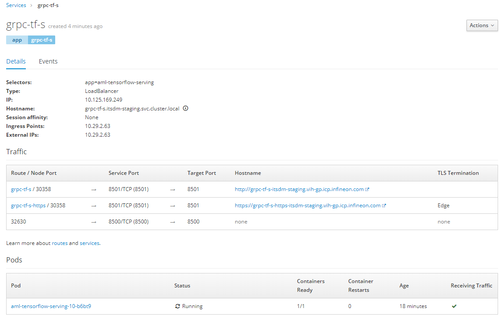

# tensorflow serving

## Objective: standard setup with needed features

## v1: plain[docker-hub based,http(s)/rest,gRPC]

### Status: dev

Based on: https://hub.docker.com/r/tensorflow/serving

Default Model: saved_model_half_plus_two_cpu

ENVIRONMENT variables according to docker hub docu.

HTTP/REST@8501
gRPC:8500

### openshift notes:

#### Getting started:
* Prerequisits:
  * ICP-Project for building and deployment
  * Bitbucket access
  * ICP-Buildpipeline has access to bitbucket.
  
* Building
```bash  
first:   oc new-build <workarea-pwd> -n <icp-build-project> --source-secret=<bitbucket-secret>
rebuild: oc start-build -n <icp-build-project> <build-name> --follow
```

* Deployment
TBU

* Services/Routes - see below

#### HTTP(s)/REST: 
```bash
  oc create service nodeport <service-name=deploymentname> --tcp=8501:8501
  oc expose service <service-name> 
```
*  --> enables http route to the deployment
*  --> https route via gui and edge termination
  
#### gRPC+http(s)/rest: 
```bash
  oc create service loadbalancer <service-name=deploymentname> --tcp=8500 --tcp=8501
```
*  --> https route via gui and edge termination
*  --> gRPC via external IP - noTLS 

  


### Testing:
   `http://<route-url>/v1/models/default`
```json
{
 "model_version_status": [
  {
   "version": "123",
   "state": "AVAILABLE",
   "status": {
    "error_code": "OK",
    "error_message": ""
   }
  }
 ]
}
```

## v2: plain + data_pump
## v3: tls + plain + data_pump
## v4: auth + tls + plain + data_pump
